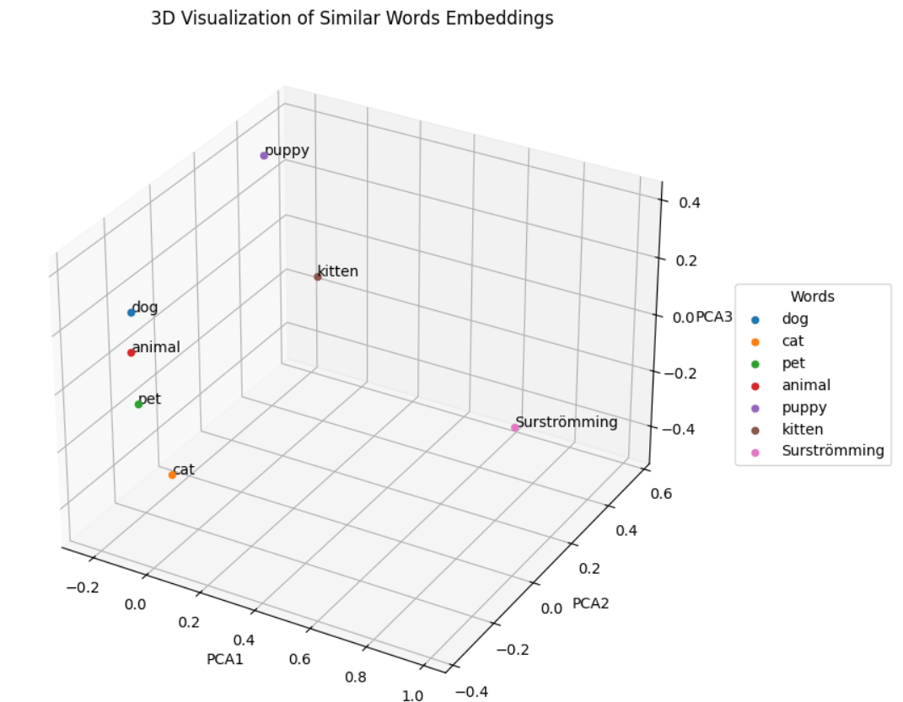

# Vector Visualizer

This repository provides a powerful and intuitive visualization tool for exploring vector embeddings, a foundational concept in machine learning and natural language processing (NLP). 
Embeddings are high-dimensional numerical representations of data—commonly used to encode semantic information about words, sentences, or other entities. 
By capturing relationships such as similarity and context, embeddings allow algorithms to process and analyze data with meaningful geometric structure. 

For example, word embeddings can represent the semantic similarity between words like "king" and "queen" or "car" and "vehicle" as vectors close in space. However, understanding these complex, high-dimensional embeddings can be challenging. This tool bridges the gap by reducing the dimensionality of embeddings and visualizing them in an interactive, human-readable format. By providing an accessible way to explore how vectors capture relationships within datasets, this tool empowers users to better understand semantic structures, debug models, and gain insights into the behavior of embedding-based algorithms.

# How to use

- Open the Notebook in VS Code or other Jupyter Notebook IDE.
- Copy or rename config.env to my-config.env and fill in the values for OpenAI.
- Run the first three cells.
- Run the last cell to visualize the words in the text array.
- Modify any of the words to see how the visualization changes.

# Visualizing Embeddings

Here is what the 3D graph looks like

